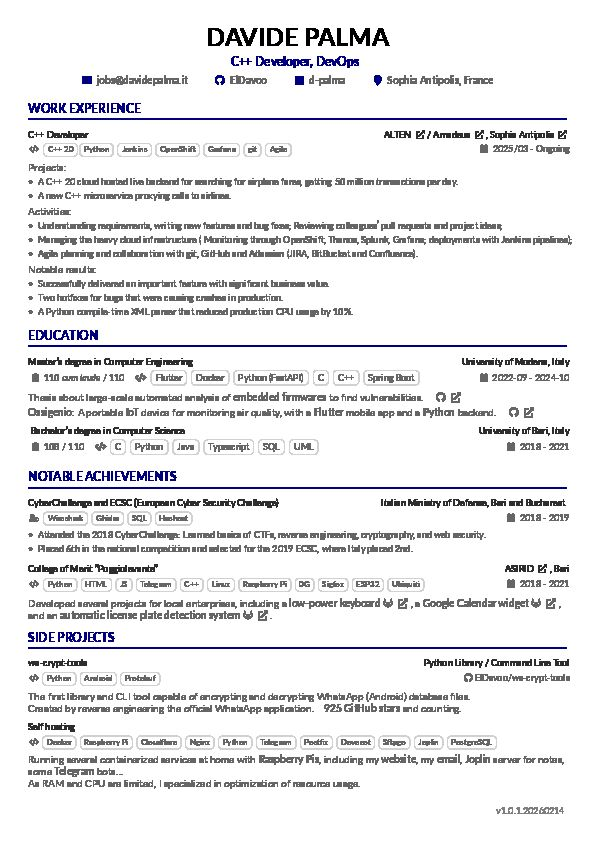

# Davide Palma's Resume

This is my resume, based on the
[techResume](https://github.com/alexcalabrese/techResume) template.
It mainly adds multilanguage support, based on the latexmk job name feature,
and a set of commands to switch between languages.

## How to build it

There are multiple ways to build the resume.  
The multilanguage machinery needs lualatex, so don't use pdflatex.  
Each way is actually using a different TeX distribution, which is quite funny.
All ways use latexmk. I don't know if other build systems would work.  

### 1) Using GitHub Actions

Just push to the `main` branch, and the compiled PDF will be available
in the Actions tab.
Tag the commit to create a release with the PDF attached.  

### 2) Using Nix
If you have Nix installed, you can build the resume with:

```bash
nix build
```

You will have the results in a `result` symlink.  
Thank you [flyx](https://flyx.org/nix-flakes-latex/) for your help.  

### 3) Using VS Code + LaTeX Workshop extension

Open the project in VS Code, and make sure you have the LaTeX Workshop extension.  
This extension by default uses a Docker container with TeX Live installed.  

### 4) Manually ?

I guess you can run 
```bash
latexmk -lualatex -interaction=nonstopmode -shell-escape -pdf -lualatex -jobname=resume-en \
            -usepretex='\RequirePackage{luatex85,shellesc}' resume.tex
```
if you have the required packages installed.  

### 5) Using Overleaf ??

I guess you can also use Overleaf??  

## Contributing

Thank you for considering contributing! ❤

## Preview


